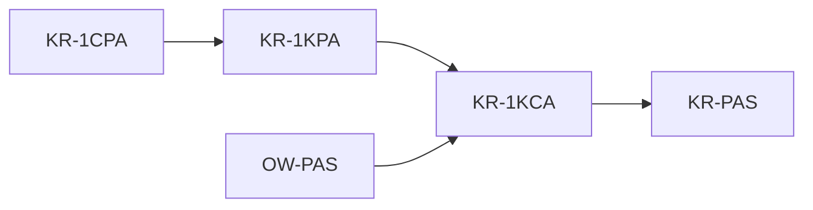

## Nonce-Based Encryption
- A nonce-based scheme E is a triple of algs (Kg, Enc, Dec)
	- Kg() -> k: key
	- Enc(k: key, n: nonce, m: message) -> c: ciphertext
	- Dec(n: nonce, c: ciphertext, k: key) -> m': message
- E is **correct iff** for all k that Kg can produce, all valid nonces and messages, the Dec of the Enc is m

### Indistinguishability
- Consider a game:![[Pasted image 20231220140758.png]]
- The advantage of an attacker in distinguishing a nonce-based scheme from random ciphertexts is $$\text{Adv}_{E}^{(n)\text{ind}}(A) = \text{Pr}[\text{Exp}_{E}^{(n)\text{ind-real}}(A) : \hat{b} = 1] - \text{Pr}[\text{Exp}_{E}^{(n)\text{ind-ideal}}(A) : \hat{b} = 1]
$$
	- note: the requirement for no repeat messages has been changed for no repeat nonces, so the nonce-message pairs are also always guaranteed to be unique

## Reductions

### From Strong to Weak Powers

- Security against "strong" adversaries (with more powers) should imply security against "weaker" adversaries (with fewer powers)
- We can make a reduction showing $(t,\epsilon)$-KR-1CPA security implies $(t,\epsilon)$-KR-1KPA
	- **If** the probability of $A$ **recovering the key**, provided the ciphertext for 1 **chosen** plaintext and time $\le t$ is $\le\epsilon$
	- **Then** the scheme must also be $(t,\epsilon)$-secure against an adversary who is provided a **known** (but not chosen) plaintext and ciphertext pair
- Strategy:
	- We want to show $(t,\epsilon)$-KR-1CPA secure **implies** $(t,\epsilon)$-KR-1KPA secure
	- -> Equivalent to $(t,\epsilon)$-KR-1**K**PA **insecurity** implies $(t,\epsilon)$-KR-1**C**PA **insecurity**
		- note, here we go from K->C
		- "if you're insecure against K, you **must** be insecure against C" is equivalent to "if you're secure against C, you're secure against K"
	- -> we want to show "If there's a working adversary against K, there also exists (/we can construct from it) an adversary against C"
	- We call the **new adversary** $B$ the *reduction*
	- Two important claims about $B$:
		- $B$ has same or better advantage 
		- $B$ runs in same or less time
	- These claims might be called the *analysis* of the reduction
- ![[Pasted image 20231220163626.png]]
- The reduction $B_{kr-1cpa}$ (in outer dashed lines) just runs the adversary $A_{kr-1kpa}$ after sampling a plaintext randomly from the plaintext space. This sampling is its only overhead so it essentially runs in the same time as $A_{kr-1kpa}$.
- The two adversaries share a challenge key and key guess, so whenever $A$ wins, so does $B$. This implies their advantage is the same.

### From Hard to Easy Goals
- Just as **adversary capabilities** can be ranked, there is a similar hierarchy of **security goals**
- Usually this goes indistinguishability > one-wayness > key recovery
- A reduction from OW-PAS (passive one-wayness: no full recovery of the plaintext from the ciphertext) to KR-1KCA (key recovery from 1 known ciphertext):
	- My try:
		- "if E is OW-PAS secure, it is KR-1KCA secure" -> "if E is KR-1KCA insecure, it is OW-PAS insecure"
		- i.e. if an attacker can recover the key with 1 known ciphertext, a derived attacker can recover the full plaintext from a ciphertext
		- essentially clear because if you can get the key from any (non-chosen) ciphertext, then you can get the plaintext using the decryption alg
		- in other words, if you can't get the plaintext from the ciphertext, you **must** not be able to get the key from it (otherwise you would be able to get the plaintext)
	- 