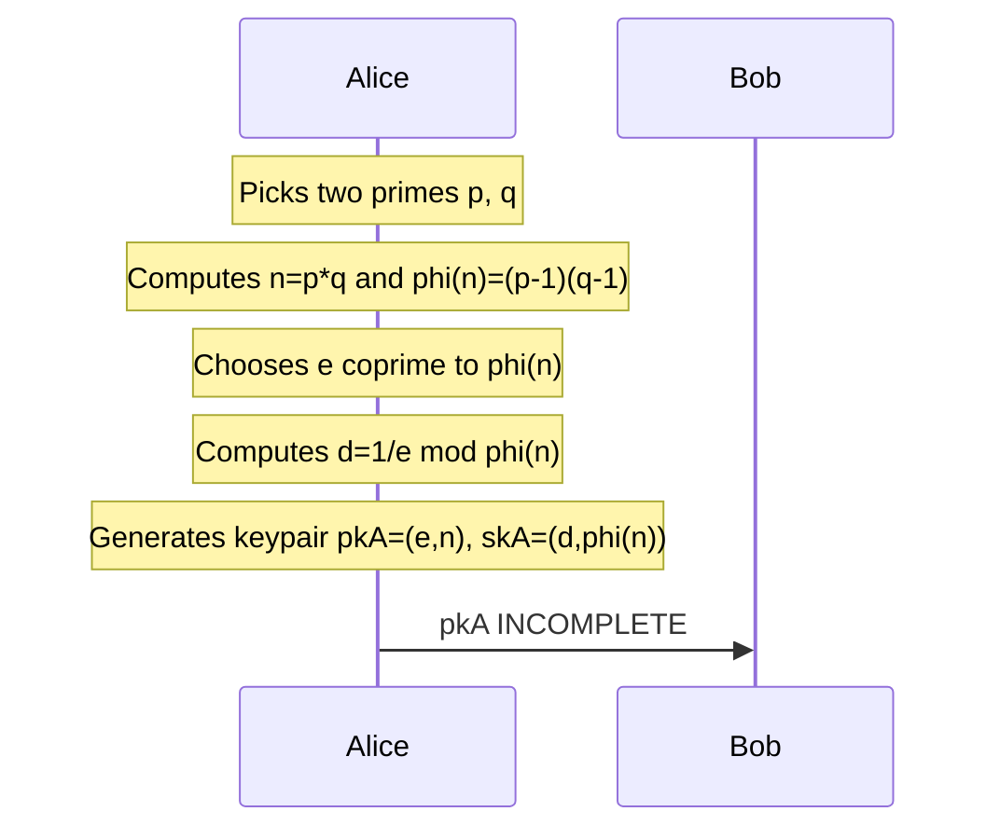

# RSA
- A **message encryption scheme**

>[!define] Euler $\varphi$ Function
>For a positive integer $n$, $\varphi(n)=\abs{\{a\in\mathbb{Z}}1\le a\lt n and \gcd(a,n)=1\}|$
>For example: $\varphi(5)=\abs{\{1,2,3,4\}}=4$, $\varphi(6)=\abs{\{1,5\}}=2$
>
>For two primes $p,q$, $\varphi(pq)=(p-1)(q-1)$
>^euler-phi-function-def

## Setup (keygen)
1. A picks two $\lambda$-bit primes $p\ne q$
2. A computes $n=p\times q$ and $\varphi(n)=(p-1)(q-1)$
3. A chooses $e$ coprime to $\varphi(n)$
4. A computes $d\equiv e^{-1}\mod \varphi(n)$
5. A generates a keypair: $pk_A=(e,n), sk_A=(d,\varphi(n))$
6. A sends $pk_A$ to B

## Encryption
7. B encodes a message as $m=\{0,...,n-1\}$
8. B computes ${enc}_m=m^e\mod n$
9. B sends ${enc}_m$ to A

## Decryption
10. A computes $m={{enc}_m}^d\mod n$
	- $=m^{ed}\mod n=m^{1+k\varphi(n)}=m\times {m^{\varphi(n)}}^k\mod n$

>[!define] Fermat's Little Theorem
>Let $p\ne q$ be primes, and $a\in \mathbb{Z}$ such that $\gcd(a,pq)=1$ ($a$ is *coprime* to $pq$).
>
>$$a^{p-1}\equiv 1 \mod p$$
>$$a^{(p-1)(q-1)}\equiv 1 \mod pq$$
>$$a^{-1}\equiv a^{p-2}\mod p$$
>^fermat-little-theorem-def

## Adversary's Game
Given $e, n, m^e\mod n$, adversary wants to find **any** of $d, \varphi(n), m$.
- Factoring $n$ to find $p, q$ will allow finding $\varphi(n)=(p-1)(q-1)$ (see [[#^euler-phi-function-def|Euler's Phi Function]])
- Finding $m$ from $e, n, m^e\mod n$ is related to the [[Discrete Logarithm Problem]]

## Efficiency
Efficient operations needed:
- picking primes
- multiplying
- choosing coprimes
- inversion mod $\varphi(n)$
- exponentiation $\mod n$

## Notes
Things we want to be hard:
- $n \rightarrow \varphi(n)$ i.e. factoring
- $c \rightarrow m$ i.e. computing $e^{th}$ roots $\mod n$
- 